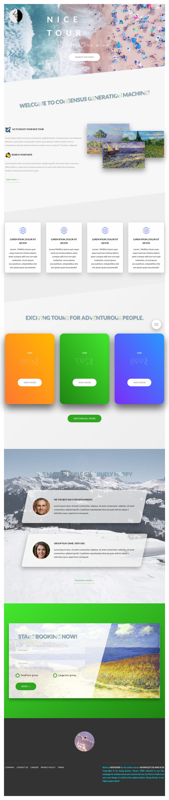
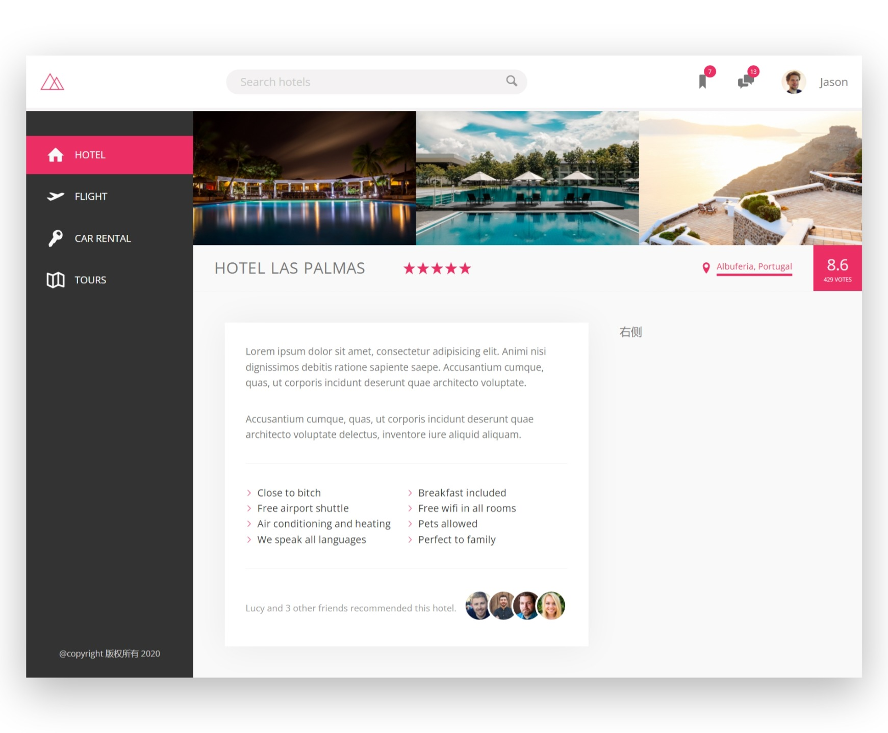
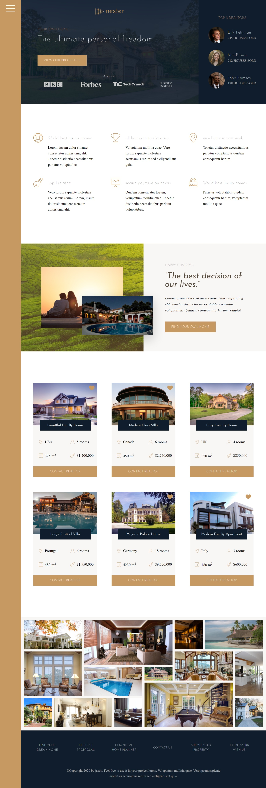

# 静态站点

## 1. 旅游网页

**关键词：**
传统布局、组件化、响应式布局、媒体查询、BEM 命名法、原子类、iconfont

  
详细描述

**HTML 特性：**
1. 语义化标签： nav, header, main, section, footer
2. `<picture> <source media="" srcset="1,2,3"> </picture>`
3. `<figure> Other Info <figcaption> Description </figcaption> </figure>`
4. 使用 `input:checked` 弹出 `nav`
5. 使用 `#target` 控制元素显示

**CSS 特性：**
1. 基于 rem
2. css variables
3. calc
4. clip-path
5. backdrop-filter
6. background-image: 叠加渐变与图片
7. will-change
8. backface-visibility
9. object-fit
10. column-count, column-gap, column-rule, hyphens
11. media query: min-width, max-width, min-resolution, -webkit-min-device-pixel-ratio
12. BEM 命名法

## 2. 旅馆网页

**关键词：**
Flexbox layout、 svg 雪碧图

  
详细描述

**HTML 特性：**
1. 使用 svg 雪碧图链接资源:
   `<svg> <use xlink:href="sprite.svg#icon-bookmark"></use> </svg>`
2. Flexbox layout
3. fill: currentColor

**CSS 特性：**
1. 基于 rem, BEM
2. CSS variables
3. -webkit-mask-image, -webkit-mask-size

## 3. 大 House 网页

**关键词：**
Grid layout

  
详细描述

**HTML 特性：**
1. `` 标签

**CSS 特性：**
1. Grid layout
2. Responsive layout based on grid
3. BEM

